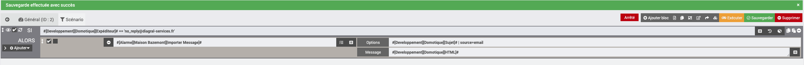
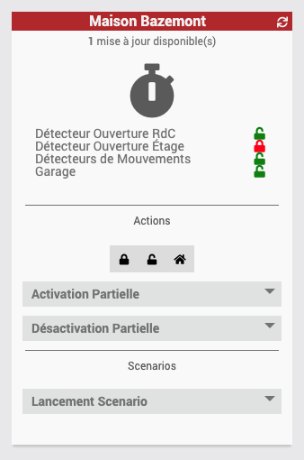

# Présentation 

Diagral est un constructeur français d'alarme, appartenant au groupe HAGER :
[https://www.diagral.fr/qui-sommes-nous]

Les nouvelles alarmes Diagral sont sous l'appellation e-ONE.
Par cette appellation, Diagral entre dans l'ère des alarmes connectés au travers d'une application portant le même nom.

Ce plugin Jeedom vous permet d'interragir avec votre alarme Diagral e-ONE au même titre que l'application officielle.

# Principe 

Diagral propose uniquement une méthode Cloud d'interraction avec votre alarme, par conséquent ce plugin utilise une connexion internet pour interragir avec votre alarme.

C'est donc une interface __CLOUD__

# Configuration

__Le plugin se veut simple (et non simpliste) en utilisation et en configuration__.
Tout ce que le plugin peut récupérer via le Cloud Diagral est fait afin de vous éviter des configurations inutiles et source d'erreurs.

Le plugin comporte une configuration générale.
Vous y saissez les informations suivantes :

-   Identifiant : Adresse email utilisé sur l'application mobile Diagral e-ONE
-   Mot de passe : Le mot de passe associé à l'identifiant
-   Nombre de tentatives : Nombre de tentative en cas d'échec de connexion au Cloud Diagral (default : 1)
-   Délai entre les tentatives : Délais entre les tentatives (en secondes)
-   Verbose : Permettant de définir un niveau de verbosité pour les requètes vers le Cloud Diagral (_Pas encore utilisable_)

## Configuration d'un équipement

La création de l'équipement se fait de façon automatique. Il vous suffit de cliquer sur Synchronisation dans le plugin, pour que chacune des alarmes configurées et finalisées dans votre compte Diagral, soit créée. Elles sont automatiquement nommées tels que dans l'application Mobile Diagral.

Une fois le/les alarmes créées, il faut entrée dans chacunes d'elles afin de configurer :
-   le __Master Code__ (celui que vous utilisez pour vous connecter à votre alarme avec l'application Mobile Digral e-ONE).
-   l'objet parent
-   activer l'équipement

Lors de la sauvegarde, de nouvelles commandes vont se créer car elle necessitent le MasterCode (ex : _Activation Partielle ou Lancement Scenario).

Ces commandes sont en fait les commandes qui permettent d'avoir une liste déroulante dans les scénarios. Ainsi le plugin va personnaliser les listes déroulantes avec les informations présentes sur votre compte.

# Rafraichissement

## Automatique

Une CRON est automatiquement créé sur base du délai entre les tentatives indiqué dans la configuration du plugin.

## Manuel

Dans un scénario, vous pouvez utiliser la commande __Rafraichir__ afin de reforcer un refresh de l'alarme

## A reception d'un Email ou SMS

Le plugin permet de recevoir des informations non disponibles par l'API (utilisateur intervenu, declenchement d'alarme, etc...) au travers d'Email ou SMS.
Le plugin ne gère pas la collecte Email ou SMS. Il faut donc s'appuyer sur d'autre plugin qui vont transmettre le message au plugin.
La commande utilisée pour recevoir le message est __Importer Message__

> Actuellement, seul le plugin [Mail Listener](https://www.jeedom.com/market/index.php?v=d&p=market&author=lunarok&&name=Mail%20Listener) de Lunarok est validé comme compatible.
> 
> Mais il n'y a pas de raison que cela ne fonctionne pas avec d'autres plugins.

Dans la commande, vous devez avoir :
- dans __Options__
  - Le sujet du message (si vous n'en avez pas comme dans le cas d'un SMS ne pas le mettre)
  - Un "|" qui sert de séparateur (_uniquement si j'ai un sujet avant_)
  - Les arguments
    - source (choix possible : email ou sms)
- dans __Message__
  - Le message reçu

> Actuellement la gestion des messages Email n'est pas complete
> 
> N'hésitez pas à participer en indiquant les messages non encore gérés afin de les integrés
> Pour cela, il suffit de récuperer le message dans le log _Warning_ généré (cf. Diagnostique pour définir le niveau de log) et d'[ouvrir une demande sur le Github du plugin](https://github.com/mguyard/Jeedom-Diagral_eOne/issues/new?assignees=mguyard&labels=enhancement&template=message---ajout-du-support-d-un-nouveau-message.md&title=%5BMSG-ADD%5D)

# Caching

Afin d'eviter de trop requêter les serveurs Diagral, le plugin cache les informations suivantes :
-   Les groupes configurés dans l'alarme
-   Les scénarios configurés dans l'alarme
Le cache est regénéré automatiquement tout les dimanches à une heure aleatoire (définie a l'installation au travers d'une CRON).

Vous pouvez forcer la regéneration manuellement avec les commandes 
-   __Force Groups Refresh__ 
-   __Force Scenarios Refresh__

# Commandes

Il existe actuellement plusieurs commandes qui sont décrites ci-dessous :

## Action

-   __Rafraichir__ : Mise à jour du statut de l'Alarme
  
-   __Désactivation Totale__ : Arrêt de l'alarme

-   __Désactivation Partielle__ : Permet de désactiver un groupe de l'alarme
    -   _La désactivation d'un groupe ne peut être effectuée que lorsque l'alarme est activée (à l'exclusion du mode présence)_

-   __Activation Mode Presence__ : Activation avec le mode spécial Présence

-   __Activation Partielle__ : Activation de quelques groupes uniquement.
    -   _Le choix des groupes est définissable uniquement au travers d'une action dans un scénario_
    -   _Lors d'un 'Tester' sur la commande, seul le premier groupe de la liste déroulante (à savoir le moins long) sera executé_

-   __Importer Message__ : Collecte d'un message (mail ou SMS)

-   __Force Groups Refresh__ : Rafraissement des fichiers de groupes
    -   _Le plugin génère des fichiers JSON (#pluginDirectory#/core/class/config/groups_*.json) afin d'éviter d'interroger très regulièrement le cloud Diagral et ainsi éviter de se faire Blacklister temporairement le compte.
    -   Un fichier JSON par équipement. Le * correspond au systemID indiqué sur chaque équipement
    -   Une CRON Diagral_eOne/generateJsonAllDevices se lance tout les dimanches pour mettre à jour ces fichiers (l'heure est défini aléatoirement à l'installation pour eviter les effets de masse sur le Cloud Diagral).

-   __Force Scenarios Refresh__ : Rafraissement des fichiers de scénarios
    -   _Le plugin génère des fichiers JSON (#pluginDirectory#/core/class/config/scenarios_*.json) afin d'éviter d'interroger très regulièrement le cloud Diagral et ainsi éviter de se faire Blacklister temporairement le compte.
    -   Un fichier JSON par équipement. Le * correspond au systemID indiqué sur chaque équipement
    -   Une CRON Diagral_eOne/generateJsonAllDevices se lance tout les dimanches pour mettre à jour ces fichiers (l'heure est défini aléatoirement à l'installation pour eviter les effets de masse sur le Cloud Diagral).

-   __Lancement Scenario__ : Execute un scénario

## Info

-   Statut : Status de l'alarme
    -   Off : Alarme désactivé
    -   presence : Alarme en mode présence
    -   group : Alarme activé uniquement sur certains groupes
    -   tempogroup : Alarme en cours d'activation
-   Mises à jour disponibles : Indique le nombre de mises à jour disponibles sur l'alarme
-   Groupes Actifs : Liste des groupes actifs par leur nom (ex. Détecteur Ouverture Étage + Garage)
-   IMPORT - Dernier Message : Dernier message reçu par message (mail ou sms)
-   IMPORT - Derniere action : Dernière action reçue par message (mail ou sms)
    -   _Exemple "une mise à l'arrêt à distance"_
-   IMPORT - Derniere methode : Dernière methode reçue par message (mail ou sms)
    -   _Exemple "code d'accès principal"_
-   IMPORT - Dernier utilisateur : Dernière methode ayant intervenu sur l'alarme, reçue par message (mail ou sms)

# Dashboard

Le plugin inclus un dashboard qui permet de :
-   Connaitre le statut de l'alarme
-   Connaitre le nombre de mise à jour de l'alarme disponible
-   Activation totale de l'alarme
-   Activation partielle de l'alarme
-   Activation du mode présence
-   Désactivation totale de l'alarme
-   Désactivation partielle de l'alarme
-   Lancement d'un scénario

# Diagnostique

Le plugin inclus beaucoup de verbosité en mode DEBUG, il suffit alors de la configurer au niveau du plugin.
A partir de là, vous pouvez identifier les soucis que vous pouvez rencontrer.

# Roadmap

- Ajout de nouveaux messages SMS/EMAIL.
- Integration dans Homebridge

> C'est aussi vous qui aller donner la direction que prendra ce plugin, donc je suis à votre écoute
> 
> Plus une fonctionnalitée sera demandée (si elle est réalisable), plus elle sera prioritaire au developpement (pondéré par sa difficultée d'integration)
> Vous pouvez faire votre demande par en créant une demande "enhancement" [GitHub](https://github.com/mguyard/Jeedom-Diagral_eOne/issues/new) mais cela me fera plaisir si vous passez d'abord m'en parler sur le forum Jeedom.