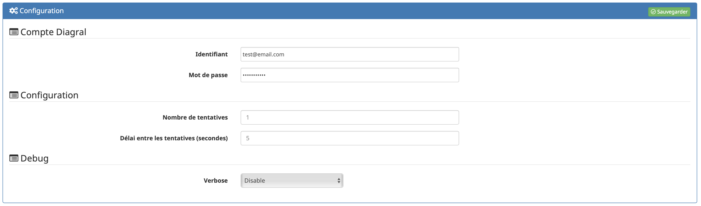
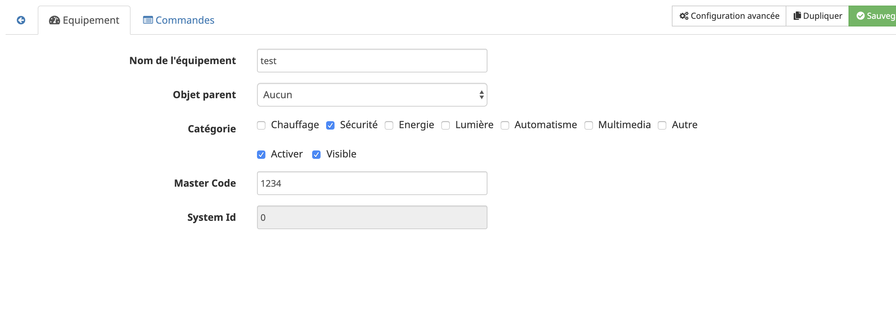
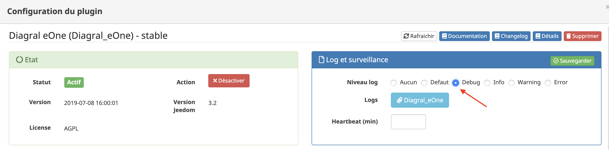

# Présentation 

Diagral est un constructeur français d'alarme, appartenant au groupe HAGER :
https://www.diagral.fr/qui-sommes-nous

Les nouvelles alarmes Diagral sont sous l'appellation e-ONE.
Par cette appellation, Diagral entre dans l'ère des alarmes connectés au travers d'une application portant le même nom.

Ce plugin Jeedom vous permet d'interragir avec votre alarme Diagral e-ONE au même titre que l'application officielle.

# Principe 

Diagral propose uniquement une méthode Cloud d'interraction avec votre alarme, par conséquent ce plugin utilise une connexion internet pour interragir avec votre alarme.

C'est donc un interface __CLOUD__

# Configuration

__Le plugin se veut simple (et non simpliste) en utilisation et en configuration__.
Tout ce que le plugin peut récupérer via le Cloud Diagral est fait afin de vous éviter des configurations inutiles et source d'erreurs.

Le plugin comporte une configuration générale.
Vous y saissez les informations suivantes :

-   Identifiant : Adresse email utilisé sur l'application mobile Diagral e-ONE
-   Mot de passe : Le mot de passe associé à l'identifiant
-   Verbose : Permettant de définir un niveau de verbosité pour les requètes vers le Cloud Diagral (_Pas encore utilisé_)

## Configuration d'un équipement

La création de l'équipement se fait de façon automatique. Il vous suffit de cliquer sur Synchronisation dans le plugin, pour que chacune des alarmes configurées et finalisées dans votre compte Diagral, soit créée. Elles sont automatiquement nommées tels que dans l'application Mobile Diagral.

Une fois le/les alarmes créées, il faut entrée dans chacunes d'elles afin de configurer :
-   le __Master Code__ (celui que vous utilisez pour vous connecter à votre alarme avec l'application Mobile Digral e-ONE).
-   l'objet parent
-   activer l'équipement

Lors de la sauvegarde, de nouvelles commandes vont se créer car elle necessitent le MasterCode (ex : _Activation Partielle ou Lancement Scenario).

Ces commandes sont en fait les commandes qui permettent d'avoir une liste déroulante dans les scénarios. Ainsi le plugin va personnaliser les listes déroulantes avec les informations présentes sur votre compte.

# Commandes

Il existe actuellement plusieurs commandes qui sont décrites ci-dessous :

## Action

-   __Rafraichir__ : Mise à jour du statut de l'Alarme
  
-   __Désactivation Totale__ : Arrêt de l'alarme

-   __Activation Mode Presence__ : Activation avec le mode spécial Présence

-   __Activation Partielle__ : Activation de quelques groupes uniquement.
    -   _Le choix des groupes est définissable uniquement au travers d'une action dans un scénario_
    -   _Lors d'un 'Tester' sur la commande, seul le premier groupe de la liste déroulante (à savoir le moins long) sera executé_

-   __Force Groups Refresh__ : Rafraissement des fichiers de groupes
    -   _Le plugin génère des fichiers JSON (#pluginDirectory#/core/class/config/groups_*.json) afin d'éviter d'interroger très regulièrement le cloud Diagral et ainsi éviter de se faire Blacklister temporairement le compte.
    -   Un fichier JSON par équipement. Le * correspond au systemID indiqué sur chaque équipement
    -   Une CRON Diagral_eOne/generateJsonAllDevices se lance tout les dimanches pour mettre à jour ces fichiers (l'heure est défini aléatoirement à l'installation pour eviter les effets de masse sur le Cloud Diagral).

-   __Force Scenarios Refresh__ : Rafraissement des fichiers de scénarios
    -   _Le plugin génère des fichiers JSON (#pluginDirectory#/core/class/config/scenarios_*.json) afin d'éviter d'interroger très regulièrement le cloud Diagral et ainsi éviter de se faire Blacklister temporairement le compte.
    -   Un fichier JSON par équipement. Le * correspond au systemID indiqué sur chaque équipement
    -   Une CRON Diagral_eOne/generateJsonAllDevices se lance tout les dimanches pour mettre à jour ces fichiers (l'heure est défini aléatoirement à l'installation pour eviter les effets de masse sur le Cloud Diagral).

-   __Lancement Scenario__ : Execute un scénario

## Info

-   Statut : Status de l'alarme
    -   Off : Alarme désactivé
    -   presence : Alarme en mode présence
    -   group : Alarme activé uniquement sur certains groupes
    -   tempogroup : Alarme en cours d'activation

# Diagnostique

Le plugin inclus beaucoup de verbosité en mode DEBUG, il suffit alors de la configurer au niveau du plugin.
A partir de là, vous pouvez identifier les soucis que vous pouvez rencontrer.

